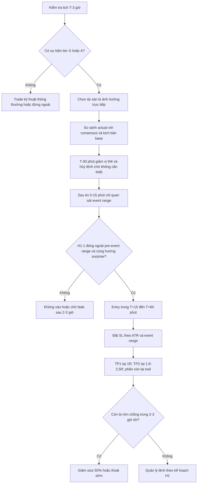

# Nghiên cứu chiến lược tin tức macro cho swing H1 trên forex và commodities

## Tóm tắt điều hành

Kết luận trung tâm của nghiên cứu này là: với giao dịch swing trên khung H1, **không nên “trade mọi tin”**. Cấu trúc tin phù hợp nhất là nhóm sự kiện có liên hệ trực tiếp với hàm phản ứng chính sách tiền tệ và kỳ vọng tăng trưởng/lạm phát, tức các sự kiện kiểu **Taylor-rule** như quyết định lãi suất, CPI, NFP, bán lẻ, cùng các báo cáo tồn kho năng lượng có tính lịch cố định với dầu và khí tự nhiên. Trong nghiên cứu high-frequency gần đây trên FX, chỉ một nhóm rất hẹp sự kiện có xác suất được mô hình chọn vượt 95% gồm: **FOMC rate decision, US nonfarm payrolls, US CPI, FOMC minutes, US retail sales, RBA cash rate, việc làm Úc, GDP Úc và bán lẻ Úc**; đồng thời paper này cho thấy biến động tăng vọt ngay sau công bố rồi tiêu tán khá nhanh, và yếu tố mùa vụ trong ngày gắn chặt với giờ mở cửa các trung tâm lớn. Điều này rất phù hợp với cách triển khai H1: **đợi xác nhận sau nhịp khám phá giá ban đầu**, thay vì vào lệnh ngay đúng thời điểm ra tin. citeturn61view0turn68view0

Về mặt cấu trúc thị trường, BIS cho biết doanh số FX OTC toàn cầu đạt **7,5 nghìn tỷ USD/ngày** trong khảo sát tháng 4/2022; USD xuất hiện ở **88%** giao dịch, euro ở khoảng **30,5%**, JPY **17%** và GBP **13%**. Điều này biện minh cho việc tập trung nghiên cứu vào EURUSD, GBPUSD, USDJPY cùng các cặp USD-beta như AUDUSD, USDCAD, NZDUSD: đó là nơi tin Mỹ và trung ương lớn có xu hướng truyền dẫn mạnh và nhanh nhất. citeturn38view0

Ở commodities, bằng chứng học thuật gần đây cho thấy WTI chịu ảnh hưởng lớn từ **lãi suất Mỹ, USD và VIX**; riêng ba biến này đã giải thích **39%** phần cải thiện RMSE trong mẫu sau 2010 và **48%** trong mẫu sau 2020 của mô hình dầu. Với đồng, nghiên cứu về COMEX copper futures cho thấy **lãi suất, công nghiệp, PPI, chỉ số tâm lý tiêu dùng và USD index** đều có ý nghĩa, trong đó **PPI là biến vĩ mô hiệu quả nhất**. Với vàng, bằng chứng cho thấy vai trò “hedge/safe haven” **không cố định trong mọi trạng thái**, mà mạnh nhất khi bất định ở mức cao. Vì vậy, chiến lược H1 đúng không phải là “một bộ rule cho mọi tài sản”, mà là **một khung chung + bộ lọc sự kiện theo tài sản**. citeturn66view0turn65view0turn67academia0

Giới hạn quan trọng: tôi **không thể hoàn tất một event-study H1 nhiều năm, đủ 6 cặp FX và 4 hàng hóa, đã chạy số liệu thực nghiệm đầy đủ trong môi trường hiện tại**, vì nguồn H1 công khai đủ tốt thường cần xác thực/API key. Tài liệu của Financial Modeling Prep xác nhận API intraday 1-hour có hỗ trợ cho forex và commodities nhưng **mọi request đều cần API key**; phía Alpha Vantage cũng cho thấy **demo key không cho truy cập lịch sử intraday full**. Vì vậy, báo cáo này được xây dựng theo hướng **evidence-based design**: kết hợp lịch chính thức, nguồn primary, các paper intraday/học thuật gần đây, cùng khung phương pháp tái tạo chặt chẽ để bạn hoặc đội nghiên cứu có thể chạy backtest H1 đầy đủ sau đó. citeturn24view0turn25view0turn25view1turn14view0

## Mục tiêu nghiên cứu và giả định

Mục tiêu của báo cáo là xây dựng một **khung chiến lược dựa trên tin macro cho swing H1** trên hai cụm thị trường: **forex majors** và **commodities vĩ mô-nhạy cảm**. Trọng tâm không nằm ở việc dự báo hướng dài hạn của kinh tế vĩ mô, mà ở việc trả lời câu hỏi: **tin nào thực sự đáng trade trên H1, trong cửa sổ nào, bằng xác nhận nào, với rủi ro nào**. Phạm vi ưu tiên gồm các cặp majors có thanh khoản và mức độ trung gian hóa toàn cầu lớn theo BIS, cùng các hàng hóa chịu tác động mạnh của lãi suất, USD, tăng trưởng, lạm phát và dữ liệu tồn kho. citeturn38view0turn66view0turn65view0

Các giả định chưa được người dùng cung cấp, nên tôi phải nêu rõ như sau. Thứ nhất, tôi giả định “swing H1” nghĩa là **giữ lệnh từ 1 đến 24 giờ**, không phải scalping dưới M15. Thứ hai, tôi giả định tài sản được giao dịch qua **spot/CFD hoặc futures proxy đủ thanh khoản**, với quy chiếu nghiên cứu là: EURUSD, GBPUSD, USDJPY, AUDUSD, USDCAD, NZDUSD; và XAUUSD, WTI/USOIL, Henry Hub/NGAS, COMEX Copper/COPPER. Thứ ba, tôi giả định việc ra quyết định dựa trên **tin có lịch trước**; tin bất ngờ địa chính trị, phát biểu bất thường, dòng tweet hay headline chiến sự được xem là lớp rủi ro riêng và không nằm trong event-study chuẩn. Thứ tư, tôi giả định cần chuẩn hóa toàn bộ lịch theo **một múi giờ duy nhất** ở tầng vận hành, tốt nhất là UTC hoặc ICT, vì nguồn chính thức hiện công bố theo ET, GMT, JST, AEST hoặc giờ địa phương. Các giả định này phù hợp với cách dữ liệu high-frequency trong nghiên cứu FX được ghép theo dấu thời gian của lịch kinh tế và theo giao dịch 24 giờ của thị trường tiền tệ. citeturn61view0turn44view3turn45view2turn47view0

Tôi cũng giả định rằng “surprise” của tin được đo theo **actual trừ consensus**, hoặc chuẩn hóa thành **z-surprise** trên lịch sử. Đây là giả định bắt buộc để chiến lược tin có thể được kiểm định đúng chuẩn. Nghiên cứu FX 2024 sử dụng lịch Bloomberg để gắn timestamp công bố vào dữ liệu 5 phút; về thực hành, điều này có nghĩa là muốn dựng backtest đúng chuẩn H1, bạn cần cả **price data H1** lẫn **consensus history** chứ không chỉ ngày/giờ công bố. citeturn61view0

Cuối cùng, tôi giả định chiến lược được thiết kế theo nguyên tắc **bảo toàn vốn trước, tối ưu hóa sau**. Vì biến động quanh tin thường tập trung ở vài chục phút đầu rồi giảm dần, H1 nên ưu tiên **confirmation trading** hơn là “click đúng giây công bố”. Cách tiếp cận này bám sát bằng chứng rằng biến động bùng lên sau công bố rồi triệt tiêu nhanh, đồng thời phù hợp với kết quả forecasting intraday cho thấy độ biến động của các cặp USD-linked có tính phụ thuộc chéo mạnh và rủi ro nội ngày đáng kể. citeturn61view0turn68view0

## Nguồn tin và lịch kinh tế ưu tiên

Đối với chiến lược H1, thứ tự ưu tiên của nguồn là: **nguồn phát hành chính thức của cơ quan công bố** → **lịch chính thức của ngân hàng trung ương/cơ quan thống kê** → **nguồn dữ liệu định lượng/API** → **newswire dùng để diễn giải nội dung sau khi tin ra**. Lý do là H1 cực nhạy với độ chính xác của timestamp và với sự khác biệt giữa “headline ra lúc nào” và “phân tích thị trường đăng lúc nào”. Các lịch chính thức dưới đây vì thế phải là backbone của hệ thống. citeturn36view0turn36view2turn36view3turn36view4turn51view0turn49view0

| Nhóm sự kiện | Nguồn ưu tiên | Dấu hiệu nên theo dõi trên H1 | Ghi chú vận hành |
|---|---|---|---|
| FOMC, statements, minutes | Federal Reserve | Quyết định lãi suất, dot plot/projections, họp báo, minutes | FOMC có lịch công bố chính thức theo năm; đây là nhóm tin lõi cho toàn bộ USD complex, vàng và gián tiếp dầu/đồng |
| CPI Mỹ | BLS | Headline, core, MoM, YoY | BLS công bố lịch CPI; các release 2026 đều ở 08:30 AM |
| NFP / Employment Situation | BLS | Nonfarm payrolls, unemployment rate, earnings | Lịch Employment Situation cũng phát hành chính thức; 08:30 AM |
| GDP, PCE / Personal Income and Outlays | BEA | GDP advance/second/third, PCE, core PCE | BEA release schedule cho thấy các release lõi thường ở 08:30 AM |
| Retail Sales, Durable Goods, Trade | U.S. Census Bureau | Advance Monthly Sales for Retail and Food Services, trade, durables | Retail sales nằm trong lịch kinh tế Census chính thức, thường 08:30 AM |
| ECB monetary policy | ECB | Decision day 2 + press conference | ECB liệt kê rõ ngày họp tiền tệ và press conference |
| MPC Anh | Bank of England | MPC Summary and Minutes, MPR | BoE xác nhận 8 kỳ/năm; lịch 2026 có ngày cố định |
| BOJ MPM | Bank of Japan | Statement, Outlook Report, Summary of Opinions | BOJ ghi rõ lịch MPM; Summary of Opinions và Minutes phát hành 8:50 a.m. |
| RBA cash rate | RBA | Media release sau họp | RBA nêu rõ media release công bố lúc 2:30 pm sau mỗi cuộc họp |
| BoC fixed announcement dates | Bank of Canada | Interest rate announcement, MPR | BoC có 8 fixed dates/năm và lịch 2026 công khai |
| RBNZ OCR / MPS | RBNZ | OCR update, Monetary Policy Statement | RBNZ cho biết OCR có ngày cập nhật kế tiếp và MPS phát hành 4 lần/năm |
| WTI / Oil inventories | EIA | Weekly Petroleum Status Report | EIA cho biết bản highlight sau 10:30 a.m., full tables 1:00 p.m. |
| Natural gas storage | EIA | Weekly Natural Gas Storage Report | EIA công bố rõ “Released … at 10:30 a.m.” |
| Bối cảnh chu kỳ toàn cầu | IMF WEO | Tăng trưởng, rủi ro chu kỳ, lạm phát cơ sở | Không dùng để trade headline H1, nhưng rất mạnh cho regime filter |

Nguồn: Fed, BLS, BEA, Census, ECB, BoE, BOJ, RBA, BoC, RBNZ, EIA, IMF. citeturn36view0turn36view2turn36view3turn36view4turn51view0turn46view3turn47view0turn44view3turn45view2turn43view2turn42view2turn36view5turn49view0turn52view2

Về tần suất, lịch chính thức hiện cho thấy: CPI Mỹ, NFP, PCE, retail sales đều có nhịp đều hàng tháng; BoE họp **8 lần/năm**; BoC điều hành chính sách trên **8 fixed dates/năm**; RBA ra quyết định sau từng cuộc họp với thông cáo lúc **2:30 pm**; và BOJ đăng Summary of Opinions/Minutes theo lịch định sẵn, với thời gian phát hành chuẩn được ghi rõ. Điều này rất quan trọng với H1, vì các sự kiện có nhịp cố định cho phép bạn xây được playbook và thống kê ổn định hơn so với headline bất ngờ. citeturn47view0turn43view2turn45view2turn44view3

Về nguồn dữ liệu giá, tài liệu của Financial Modeling Prep xác nhận họ có endpoint **historical-chart/1hour** cho cả forex và commodities, nhưng đồng thời nhấn mạnh mọi request phải được **authorized bằng API key**. Alpha Vantage có ví dụ intraday FX bằng key demo, nhưng khi gọi **outputsize=full** bằng demo thì trả về thông báo rằng demo key chỉ để minh họa. Vì vậy, để tái tạo đầy đủ panel H1 2–5 năm, bạn nên xem **broker export/licensed feed** là lớp dữ liệu nghiên cứu chính; FMP/Alpha Vantage phù hợp để dựng bản thử nghiệm hoặc kiểm định nhanh, không nên là nguồn duy nhất cho một báo cáo production-grade. citeturn24view0turn25view0turn25view1turn13view0turn14view0

## Phân loại tin theo tác động và khung H1

Điểm then chốt của H1 là phân loại tin không chỉ theo “mức độ quan trọng” trên lịch kinh tế, mà còn theo **khả năng tạo cấu trúc giá usable trên H1**. Nghiên cứu FX gần đây cho thấy, trong hàng trăm event, chỉ một số ít thực sự có xác suất được lựa chọn rất cao: FOMC, NFP, CPI, FOMC minutes, retail sales Mỹ, cùng các event chính sách và tăng trưởng nội địa của đồng tiền bản địa. Điều đó ủng hộ cách phân loại sau: **tác động rất cao**, **cao nhưng cần lọc surprise**, **trung bình**, và **khó trade trên H1**. citeturn61view0

| Cấp tác động | Loại tin | Tài sản ưu tiên | Độ phù hợp với H1 |
|---|---|---|---|
| Rất cao | Quyết định lãi suất và họp báo của Fed, ECB, BoE, BOJ, RBA, BoC, RBNZ | Tất cả majors; XAUUSD; gián tiếp USOIL/COPPER | Phù hợp nhất nếu đợi nến xác nhận sau nhịp khám phá giá |
| Rất cao | CPI Mỹ, NFP Mỹ | USD complex, XAUUSD, đồng, dầu qua kênh USD/lãi suất | Phù hợp rất cao cho breakout hoặc continuation 15–180 phút |
| Cao | PCE, retail sales, GDP advance, triển vọng/Minutes | USD majors, XAUUSD, chỉ một số commodities | Tốt khi surprise lớn và không bị tin mạnh hơn chồng lấn |
| Cao cho commodity riêng | WPSR dầu, WNGSR khí tự nhiên | USOIL, USDCAD; NGAS | Phù hợp nhất với setup event-specific, time-decay nhanh |
| Trung bình | PMI, trade balance, housing, durable goods | AUDUSD, NZDUSD, COPPER, một phần USD majors | Chỉ trade khi có surprise rõ và cùng regime |
| Thấp hoặc dễ nhiễu | Revisions lẻ, speeches không có decision, dữ liệu backward-looking nhỏ | Hầu hết | Thường không đáng mở vị thế H1 độc lập |

Nguồn/thuyết minh: phân loại này được suy ra từ event selection trong nghiên cứu high-frequency FX và từ lịch chính thức của các ngân hàng trung ương/cơ quan thống kê, cộng thêm đặc thù hàng hóa gắn với WPSR/WNGSR của EIA. citeturn61view0turn36view5turn49view0

Một cách hữu ích hơn để nhìn H1 là theo **cửa sổ thời gian sau tin**. Paper về AUD cho thấy biến động tăng mạnh **sau** công bố, không tăng đáng kể **trước** công bố, và mô hình cho phép event tác động tới volatility tối đa **30 phút** sau tin; đồng thời với perspective H1, phần khả dụng để vào lệnh thường đến **sau đoạn price-discovery đầu tiên**. Đây là cơ sở để dời trọng tâm sang xác nhận 15–60 phút thay vì “bắn lệnh” ngay tại headline. citeturn61view0

| Cửa sổ | Chức năng trên thị trường | Hành động phù hợp với H1 |
|---|---|---|
| T-180 đến T-30 phút | Chuẩn bị, giảm vị thế, xác nhận lịch không chồng lấn | Không mở lệnh mới trừ khi là lệnh hedge/exit |
| T-30 đến T+15 phút | Khám phá giá, spread và slippage dễ xấu | Không entry H1 mặc định |
| T+15 đến T+60 phút | Xác nhận hướng sau tin | Cửa sổ tốt nhất cho entry đầu tiên |
| T+60 đến T+180 phút | Continuation hoặc fade có điều kiện | Tốt cho add-on, re-entry, hoặc partial profit |
| T+180 đến T+360 phút | Thị trường chuyển sang hấp thụ sâu hơn | Tốt cho trailing stop hoặc mean-reversion vừa phải |

Bảng trên là **suy luận thực hành** từ bằng chứng high-frequency về spike-volatility sau tin và tính mùa vụ intraday quanh giờ mở cửa các trung tâm lớn. citeturn61view0turn68view0

## Phương pháp luận và tái tạo phân tích

Nếu bạn muốn biến báo cáo này thành một backtest H1 production-grade, phương pháp nên là **event study có consensus surprise**, không phải backtest theo nhãn “high/medium/low” của lịch kinh tế. Tập dữ liệu tối thiểu cần bốn lớp: **timestamp chính thức**, **consensus và actual**, **giá H1 hoặc M5/M1 để aggregate lên H1**, và **metadata về spread/slippage/session**. Nghiên cứu FX 2024 ghép timestamp của lịch Bloomberg vào dữ liệu 5 phút và cho thấy cách làm này hoàn toàn khả thi ở quy mô lớn. citeturn61view0

Khung mẫu được khuyến nghị là **2–5 năm gần nhất**, nhưng nên bắt đầu ở mức **2 năm** để đảm bảo tính đồng nhất của chế độ chính sách và hạn chế đứt gãy microstructure sau các giai đoạn cực đoan. Tập tài sản gồm 6 cặp forex và 4 hàng hóa như người dùng yêu cầu. Với forex, nên phân tách event thành hai họ: **USD-centric** và **domestic-centric**. Với hàng hóa, nên tách thành: **rates/USD-sensitive** (XAUUSD, COPPER), **inventory-sensitive** (USOIL, NGAS), và **hybrid macro-sensitive** (USDCAD qua kênh dầu + BoC). Cách phân tầng này nhất quán với phát hiện rằng other event families ngoài Taylor-rule có xác suất thấp hơn đáng kể trong việc giải thích volatility FX, còn dầu và đồng lại phụ thuộc mạnh vào rates/USD/vĩ mô chu kỳ. citeturn61view0turn66view0turn65view0

Các biến đo phản ứng giá trên H1 nên được định nghĩa rõ ràng như sau:

\[
R_{0,6h} = \max(H_{1..6}) - \min(L_{1..6})
\]

Trong đó \(H_{1..6}\) và \(L_{1..6}\) là đỉnh/đáy của 6 nến H1 sau thời điểm công bố.

\[
Breakout\ Probability = \Pr\left(\left|C_h - Range_{pre}\right| > k \cdot ATR_{14,H1}\right), \quad h \in [1,6]
\]

\[
Latency = \min \left\{ h \in [1,6] : |r_h| > \theta \sigma_{pre} \right\}
\]

Với \(Range_{pre}\) là vùng giá của 3–6 giờ trước tin, \(ATR_{14,H1}\) là ATR H1 trước tin, và \(\sigma_{pre}\) là độ lệch chuẩn lợi suất trước sự kiện.

Về mặt thống kê, bạn nên tính ít nhất các chỉ tiêu sau cho từng event-family và từng asset: **trung bình**, **độ lệch chuẩn**, **median**, **xác suất breakout**, **xác suất close-cùng-hướng-surprise ở H1-1 và H1-2**, và **thời gian trễ trung vị**. Để kiểm định ý nghĩa, nên so sánh mẫu “news hours” với các giờ đối chứng cùng session và cùng thứ trong tuần bằng **Welch t-test**, **Mann–Whitney**, và **bootstrap CI 95%**. Nếu có nhiều event chồng nhau trong vòng 6 giờ, nên loại khỏi mẫu hoặc gắn cờ “overlap” để tránh phóng đại tác động. Đây là chuẩn cần có nếu bạn muốn p-value và kết luận thống kê thực dụng chứ không chỉ mô tả. citeturn61view0turn68view0

Về tái tạo dữ liệu, bộ công cụ tối thiểu có thể là Python hoặc R với quy trình sau: lấy timestamp từ các lịch chính thức; lấy price intraday từ broker export hoặc vendor có H1; chuẩn hóa UTC; ghép event với price; tính surprise; tính phản ứng 0–6 giờ; chạy kiểm định; xuất dashboard. Về tầng dữ liệu/API, FMP xác nhận hỗ trợ endpoint **historical-chart/1hour** cho EURUSD và commodities như GCUSD, nhưng do cần API key nên chỉ nên xem là một lựa chọn có điều kiện; Alpha Vantage demo không đủ cho intraday full-history. citeturn24view0turn25view0turn25view1turn14view0

Một pipeline tái tạo gọn có thể viết như sau:

```text
1. Lấy lịch official: Fed/BLS/BEA/Census/ECB/BoE/BOJ/RBA/BoC/RBNZ/EIA
2. Chuẩn hóa timezone về UTC hoặc ICT
3. Nạp price intraday M5 hoặc H1 cho 10 mã
4. Tính consensus surprise và z-surprise cho từng event
5. Gắn event window: pre = [-6h,0), post = (0,+6h]
6. Tính R_0-6h, breakout, latency, close direction, ATR ratio
7. So sánh news vs matched non-news windows
8. Kiểm định Welch t, Mann-Whitney, bootstrap CI
9. Xuất bảng asset x event-family x metrics
10. Sinh rulebook H1 từ các event-family có edge bền
```

## Phân tích dữ liệu lịch sử và ma trận tài sản

Phần này cần nói rất rõ: **tôi chưa chạy được backtest H1 đầy đủ 2–5 năm cho cả 10 mã trong môi trường hiện tại**; do đó, thay vì đưa ra “số đẹp nhưng yếu nền tảng”, tôi tổng hợp **bằng chứng định lượng có độ tin cậy cao nhất hiện có** và chuyển chúng thành **ma trận hành động H1**. Đây là cách trung thực hơn và hữu ích hơn cho một desk giao dịch. citeturn24view0turn25view0turn25view1turn14view0

### Bằng chứng định lượng then chốt hiện có

| Cụm thị trường | Nguồn định lượng | Mẫu và thước đo | Kết quả hữu ích cho H1 |
|---|---|---|---|
| FX | Martins & Lopes 2024 | AUD 5-min, 03/01/2017–31/12/2023, 2.554 ngày, 117 events, 6 lag sau event | Chỉ 9 sự kiện có posterior inclusion >95%; nhóm rất mạnh: FOMC, US NFP, US CPI, FOMC minutes, US retail sales, RBA cash rate, employment/GDP/retail sales Úc |
| FX | Martins & Lopes 2024 | Phân rã intraday volatility | Volatility spike sau công bố rồi tiêu tán; không tăng rõ trước tin; seasonality có dạng W-shape, gắn với giờ mở cửa thị trường |
| FX | Kearney, Shang, Zhao 2025 version | USD/EUR, USD/GBP, USD/JPY intraday curves | Có phụ thuộc chéo mạnh; thêm bid-ask spread giúp forecast volatilty/VaR tốt hơn |
| Oil | BIS WP 1040 | Mô hình dầu hậu 2010 và hậu 2020 | US rates + dollar + VIX chiếm 39% phần cải thiện RMSE sau 2010, tăng lên 48% sau 2020 |
| Copper | Wang & Li 2024 | COMEX copper futures, GARCH-MIDAS / DCC-MIDAS | IR, IP, PPI, CSI, DI đều có ý nghĩa; PPI là biến hiệu quả nhất |
| Gold | Bouoiyour, Selmi, Wohar | Quan hệ vàng với bất định | Vai trò hedge/safe haven không cố định; mạnh nhất khi bất định ở mức cao |

Nguồn: tổng hợp từ các paper/abstract và bản full-text có thể truy cập. citeturn61view0turn68view0turn66view0turn65view0turn67academia0

### Ma trận triển khai cho sáu cặp forex và bốn hàng hóa

Bảng dưới đây là **proxy triển khai H1**, được suy ra từ cấu trúc thị trường, lịch chính thức và bằng chứng định lượng nói trên. Nó **không thay thế** event-study H1 riêng theo broker của bạn, nhưng là khung đủ chặt để vào giai đoạn thử nghiệm có kiểm soát.

| Mã | Tin macro nên ưu tiên | Kiểu phản ứng điển hình trên H1 | Cửa sổ vào lệnh tốt nhất | Ghi chú chiến lược |
|---|---|---|---|---|
| EURUSD | FOMC, CPI Mỹ, NFP, retail sales, ECB decision/presser | Phá vỡ mạnh nếu surprise về USD hoặc divergence Fed–ECB rõ | T+15 đến T+60 phút | Cặp chuẩn để trade “USD surprise”; tránh vào ngay phút công bố |
| GBPUSD | FOMC, CPI Mỹ, NFP, BoE MPC/MPR | Nhạy với cả USD và BoE; dễ whipsaw nếu UK và US gần nhau | T+15 đến T+90 phút | Chỉ trade khi trục narrartive rõ ràng: USD hay GBP |
| USDJPY | FOMC, CPI Mỹ, NFP, BOJ MPM/Outlook | Nhạy mạnh với rates; dễ kéo dài 2–6 giờ nếu chênh divergence lớn | T+30 đến T+120 phút | Hợp continuation hơn fade |
| AUDUSD | FOMC, CPI/NFP Mỹ, RBA, jobs/GDP/retail Úc | Theo paper, nhóm tin Taylor-rule Mỹ và Úc là core driver | T+15 đến T+60 phút | Nếu tin Úc ra ngoài phiên London/NY vẫn có thể tạo setup H1 |
| USDCAD | FOMC, CPI/NFP Mỹ, BoC, WTI/EIA WPSR | Kênh kép: USD rates + dầu | T+15 đến T+90 phút | Tránh trade nếu BoC và WPSR chồng trong cùng ngày |
| NZDUSD | FOMC, CPI/NFP Mỹ, RBNZ OCR/MPS | Beta cao với USD và chính sách RBNZ | T+15 đến T+60 phút | Chỉ ưu tiên ngày có event top-tier |
| XAUUSD | FOMC, CPI, PCE, NFP; bất định vĩ mô cao | Phản ứng qua real rates/USD; mạnh khi surprise lạm phát hay regime risk | T+30 đến T+120 phút | Không coi vàng là safe haven “mọi lúc” |
| USOIL | EIA WPSR, Fed/giá USD/risk, macro cầu | Shock tồn kho tạo phản ứng nhanh; trend bền hơn khi narrative rates/USD hỗ trợ | T+15 đến T+60 phút | Event-driven và time-decay nhanh |
| NGAS | EIA WNGSR | Rất nhạy với surprise storage; có thể muted nếu số gần consensus | T+15 đến T+45 phút | Chỉ trade khi surprise đủ lớn so với 5Y average/consensus |
| COPPER | CPI/PPI, IP, USD, tăng trưởng/PMI | Nghiêng về growth & dollar; PPI là tín hiệu rất hữu ích theo academic evidence | T+30 đến T+120 phút | Hợp hơn với continuation theo macro-growth regime |

Nguồn/thuyết minh: FX dựa trên BIS và các paper intraday; dầu theo BIS Working Paper về oil drivers; đồng theo nghiên cứu COMEX copper; vàng theo nghiên cứu về uncertainty; lịch trung ương và EIA từ nguồn chính thức. citeturn38view0turn61view0turn68view0turn66view0turn65view0turn67academia0turn49view0turn36view5

### Biểu đồ thời gian cho quyết định H1

```text
T-180m        T-60m          T0           T+15m         T+60m         T+180m        T+360m
|-------------|--------------|------------|-------------|-------------|--------------|
Chuẩn bị      Thu hẹp        Công bố      Kết thúc      Xác nhận      Continuation   Quản trị/
lịch, regime  vị thế         tin          spike đầu     H1 đầu tiên   hoặc fade      thoát lệnh
```

Logic của timeline này bám theo bằng chứng rằng biến động bùng nổ sau công bố và tiêu tán nhanh, trong khi phần “đáng dùng” cho H1 thường là sau khi nhiễu ban đầu đã hình thành một event range đủ rõ để đặt stop một cách có cấu trúc. citeturn61view0turn68view0

## Quy tắc giao dịch H1 và quản trị rủi ro

Điểm quan trọng nhất của rulebook là: **entry không được dựa trên lịch**, mà phải dựa trên **surprise + cấu trúc nến H1**. Nếu không có surprise rõ hoặc close H1 đầu tiên không xác nhận được hướng, tốt nhất là bỏ qua. Điều này nhất quán với bằng chứng rằng chỉ một phần nhỏ sự kiện thực sự có sức giải thích volatility cao, và biến động quanh tin rất không đối xứng giữa các session/cặp tiền. citeturn61view0turn68view0

### Bộ quy tắc cốt lõi

| Setup | Entry | Confirmation | Time window | SL gợi ý | TP gợi ý | Sizing |
|---|---|---|---|---|---|---|
| USD breakout sau CPI/NFP/FOMC | Chỉ vào sau khi H1-1 đóng phá pre-event range cùng hướng surprise | H1-1 close ngoài range + thân nến ≥ 50% range nến + DXY narrative cùng chiều | T+15 đến T+60m | `max(0.75*ATR14_H1, 0.5*event_range)` | TP1 = 1R; TP2 = 2R; còn lại trail dưới/ trên low/high H1-1 | 0.5R chuẩn; 0.25R nếu cùng ngày còn tin tier S |
| Central bank continuation | Sau họp báo/statement nếu giá giữ được vùng phá vỡ trong H1-2 | Không quay lại trong range cũ; lợi suất/ USD hỗ trợ cùng chiều | T+30 đến T+120m | `1.0*ATR14_H1` hoặc sau swing H1 gần nhất | TP1 = 1.2R; TP2 = 2.2R | 0.5R; tối đa 0.75R nếu không có overlap |
| Oil inventory | Vào theo hướng surprise khi H1-1 giữ được event direction | Dầu và CAD không xung đột; WPSR khác biệt rõ với kỳ vọng | T+15 đến T+60m | `0.8–1.0*ATR14_H1` | TP1 = 1R; TP2 = 1.8R | 0.25–0.5R |
| Nat-gas storage | Chỉ trade nếu surprise đủ lớn và thị trường không “shrug off” | Sau 1 nến H1 vẫn không hồi quá 50% event move | T+15 đến T+45m | `1.0–1.2*ATR14_H1` | TP1 = 1R; TP2 = 1.5–2R | 0.25R, vì noise cao |
| Gold/copper macro continuation | Dựa trên shock rates/USD/inflation-growth | XAU: rates/USD cùng chiều; Copper: USD + growth proxy cùng chiều | T+30 đến T+120m | `1.0*ATR14_H1` | TP1 = 1R; TP2 = 2–2.5R | 0.25–0.5R |

Các ngưỡng ATR ở đây là **khuyến nghị thực hành của báo cáo**, được xây trên logic microstructure sau tin: H1 cần stop đủ rộng để không bị quét bởi tàn dư volatility trong 1–2 giờ đầu, nhưng không quá rộng đến mức triệt tiêu expectancy. Với dầu, bằng chứng nghiên cứu cho thấy rates/USD/VIX là bộ driver lớn; với vàng và đồng, độ nhạy với lãi suất/đồng USD và bất định/tăng trưởng giải thích vì sao nên dùng ATR rộng hơn majors. citeturn66view0turn65view0turn67academia0

### Quy tắc xác nhận

Một lệnh H1 chỉ nên được xem là hợp lệ khi đồng thời thỏa bốn điều kiện. Có surprise định lượng hoặc narrative policy đủ lớn. Có **event range** rõ trong 15–60 phút đầu. Có close H1 đầu tiên hoặc thứ hai **cùng hướng** với narrative. Và không có event Tier S khác dự kiến chồng trong 2–3 giờ kế tiếp. Các lịch chính thức của Fed, BLS, BEA, Census, BoE, ECB, EIA cho phép bạn kiểm soát khá tốt điều kiện cuối cùng; đây là lợi thế rất lớn của news trading có kỷ luật. citeturn36view0turn36view2turn36view3turn36view4turn51view0turn47view0turn46view3turn49view0

### Quản trị rủi ro

Tôi khuyến nghị ba tầng quản trị rủi ro. **Tầng một** là rủi ro mỗi ý tưởng: 0,25–0,75% NAV; mặc định 0,5%, nhưng hạ xuống 0,25% ở các ngày có FOMC + họp báo, CPI + phát biểu Fed, hoặc inventory + OPEC headline risk. **Tầng hai** là rủi ro chồng tương quan: không được đồng thời giữ đầy đủ EURUSD, GBPUSD, AUDUSD cùng một luận điểm USD mà tổng rủi ro vượt 1R portfolio. **Tầng ba** là rủi ro thanh khoản: nếu spread bất thường hoặc phiên giao dịch mỏng, bỏ lệnh dù tín hiệu đẹp. Bằng chứng forecasting intraday cũng nhấn mạnh bid-ask spread là yếu tố cải thiện dự báo volatility; điều đó nói cách khác là spread không phải “chi tiết nhỏ”, mà là phần của edge. citeturn68view0

### Sơ đồ luồng ra quyết định



Flow này là chuyển hóa trực tiếp từ logic nghiên cứu: chỉ trade nhóm event mạnh, chờ qua nhịp price-discovery đầu, rồi mới dùng H1 close để xác nhận. citeturn61view0turn68view0

## Checklist vận hành và giới hạn nghiên cứu

Một desk H1 dựa trên macro nên có checklist rất ngắn, rất cứng, lặp lại hàng ngày. Trước phiên, bạn chỉ cần xác nhận bối cảnh regime, lịch chính thức, và các cụm sự kiện có thể chồng nhau. Trong ngày, bạn chỉ cần so actual với consensus, đánh giá phản ứng 15–60 phút, rồi thực thi theo rulebook. Sau phiên, bạn cập nhật kết quả vào journal theo từng event-family, không theo từng ticker đơn lẻ; đây là cách duy nhất để biết edge đến từ **sự kiện nào**, chứ không phải từ vài lệnh may mắn. Lợi thế của các nguồn chính thức là chúng cho phép vận hành checklist với timestamp đáng tin cậy, đặc biệt ở CPI, NFP, retail sales, central banks, WPSR và WNGSR. citeturn36view2turn36view3turn51view0turn47view0turn43view2turn49view0

### Checklist hằng ngày

| Giai đoạn | Việc phải làm | Điều kiện bỏ qua lệnh |
|---|---|---|
| Tối hôm trước / đầu ngày | Đồng bộ lịch official, đánh dấu tier S/A, kiểm tra event overlap | Có hơn 2 tin lớn cùng trục trong 1 phiên |
| T-180 đến T-60 phút | Xác định tài sản chịu tác động trực tiếp và tương quan chéo | Không có consensus hoặc broker spread bất thường |
| T-30 phút | Thu hẹp/đóng vị thế ngược chiều, hủy lệnh tùy ý | Biến động đã bùng trước tin do leak/headline bất thường |
| T0 đến T+15 phút | Không vào lệnh H1 mặc định; ghi event range | Event move quá rối, wick dài bất đối xứng |
| T+15 đến T+60 phút | Chờ H1-1 hoặc H1-2 xác nhận | Close quay lại trong pre-event range |
| T+60 đến T+180 phút | Quản trị continuation, add-on nếu có retest đẹp | Có tin lớn mới chồng hoặc spread xấu |
| Cuối ngày | Journal theo event-family, asset, surprise, outcome | Không ghi chép = không được phép tăng size |

### Mẫu lịch kinh tế H1-focused

| Ngày | Giờ chuẩn hóa | Sự kiện | Consensus | Actual | Surprise z-score | Tài sản chính | Cửa sổ “no-trade” | Trigger H1 | Kết quả |
|---|---|---|---|---|---|---|---|---|---|
|  |  | CPI Mỹ |  |  |  | EURUSD / XAUUSD / USDJPY | T-30 đến T+15 | H1-1 đóng ngoài range? |  |
|  |  | NFP Mỹ |  |  |  | GBPUSD / EURUSD / XAUUSD | T-30 đến T+15 | Range break + body > 50%? |  |
|  |  | BoE MPC |  |  |  | GBPUSD | T-45 đến T+15 | H1-2 giữ được break? |  |
|  |  | EIA WPSR |  |  |  | USOIL / USDCAD | T-15 đến T+15 | Inventory surprise đủ lớn? |  |
|  |  | EIA WNGSR |  |  |  | NGAS | T-15 đến T+15 | Post-event hold > 1H? |  |

### Nguồn dữ liệu và công cụ nên dùng để tái tạo

Về dữ liệu chính thức, backbone nên là Fed, BLS, BEA, Census, ECB, BoE, BOJ, RBA, BoC, RBNZ và EIA. Về giá intraday, bạn cần một nguồn có H1 ổn định và timestamp tốt; tài liệu FMP xác nhận endpoint 1-hour cho forex/commodities tồn tại nhưng cần API key, nghĩa là hợp với giai đoạn build script hoặc kiểm định giới hạn, không đủ để coi là nguồn “miễn phí production”. Nếu muốn một lớp thử nghiệm nhanh, bạn có thể dùng Python/R để gọi API, ghép timestamp, tính metrics, rồi xuất bảng/biểu đồ; còn nếu mục tiêu là báo cáo institutional-grade, nên ưu tiên **broker export hoặc vendor có archive consensus + intraday**. citeturn24view0turn25view0turn25view1

### Giới hạn và câu hỏi mở

Giới hạn lớn nhất của báo cáo là **chưa có panel H1 đa tài sản 2–5 năm đã chạy xong trong môi trường hiện tại**, nên tôi chưa thể đưa bảng “mean/std/probability/p-value” thực nghiệm đầy đủ cho cả 10 mã như một backtest hoàn chỉnh. Lý do không phải vì thiếu khung nghiên cứu, mà vì lớp dữ liệu intraday đủ tốt để làm đúng bài toán này thường cần nguồn có xác thực và lịch sử consensus chuẩn; chính tài liệu API hiện có cũng xác nhận ràng buộc đó. citeturn24view0turn25view0turn25view1turn14view0

Câu hỏi mở quan trọng nhất để triển khai tiếp là ba điểm. Một là: broker của bạn map XAUUSD, USOIL, NGAS, COPPER sang CFD hay futures proxy nào, vì điều đó ảnh hưởng ATR và stop. Hai là: bạn có archive consensus đáng tin cậy hay không; nếu không có, chiến lược chỉ còn là “trade lịch”, không phải “trade surprise”. Ba là: bạn muốn tối ưu cho **breakout continuation** hay **post-news fade**; cả hai đều có thể làm trên H1, nhưng đòi hỏi mẫu thống kê khác nhau. Nghiên cứu hiện có nghiêng mạnh về việc **ưu tiên continuation sau xác nhận**, ít nhất đối với các event Taylor-rule lớn và các cặp USD-major. citeturn61view0turn68view0

Nếu cần chốt thành một rule duy nhất để bắt đầu thử nghiệm, tôi sẽ dùng quy tắc này: **chỉ trade H1 khi sự kiện thuộc tier S/A, surprise rõ, và H1-1 đóng ngoài pre-event range cùng hướng narrative; nếu không đủ ba điều kiện, bỏ qua**. Với forex, tập trung trước vào **EURUSD, GBPUSD, USDJPY, AUDUSD**. Với commodities, ưu tiên **XAUUSD** cho rates/inflation và **USOIL/NGAS** cho event EIA. Đó là phần tinh gọn nhất của nghiên cứu này, và cũng là nơi có tỷ lệ “signal-to-noise” tốt nhất theo các bằng chứng đáng tin cậy hiện có. citeturn61view0turn66view0turn49view0
